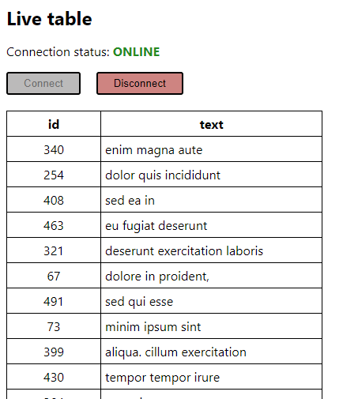

# Websocket Live Table
Обновление таблицы в реальном времени через websocket



## Server
**Стек:** node.js

Для запуск сервера необходимо установить зависимости командой **npm i**
Затем запустить сервер командой **npm start**

### Описание работы
После подключения клиента сервер первой командой отправляет клиенту данные всей таблицы, затем при измененнии данных отправляет команды только изменения части таблицы.
При изменении данные таблицы выводятся в консоль.

### Файлы проекта:
_data-table.ts_ - класс описывающий таблицу с объектами {id: number, text: string}. Класс наследуется от EventEmitter и генерирует события при добавлении, удалении, изменении и перемещении данных.

_data-table-mutation.ts_ - набор функций случайного изменения таблицы

_server.ts_ - инициализация и запуск сервера на порту 3001

Период операций добавлении, удалении, изменении и перемещении данных в таблица задан 2000мс, за один раз происходят измнения над случаным количетвом (от 1 до 5) ячеек таблицы
При необходимости можно настроить:
Периоды изменений таблицы 
```
const MUTATION_INSERT_PERIOD = 2000;
const MUTATION_DELETE_PERIOD = 2000;
const MUTATION_UPDATE_PERIOD = 2000;
const MUTATION_MOVE_PERIOD = 2000;
```

Количество строк в таблице при инициализации сервера:
```
const INIT_TABLE_SIZE = 100;
```

## Client
**Стек:** create-react-app, React, react-redux, redux-saga

Для запуск клиента необходимо установить зависимости командой **npm i**
Затем запустить клиент командой **npm start**

### Описание работы
При монтировании компонента App.js посылается action подключения к серверу. Redux-saga перехватывает action и инициализирует websocket соединение. При ошибке подключения или разрыве существующего соединения раз в секунду производится попытка повторного подключения. После успешного соединения с сервером, сервер первой командой отправляет данные всей таблицы, формируется action и таблица сохраняется в хранилище. Далее клиент от сервера получает команды только изменения данных, при этом формируются action и изменения применяются к таблице в хранилище.

### Основные файлы проекта:
_src\components\live-table\live-table.tsx_ - компонент таблицы

_src\sagas\live-table\live-table.ts_ - асинхронная работа с websocket с применением redux-saga

_src\reducers\live-table\live-table-update.ts_ - функции обновления таблицы в хранилище по полученным от сервера командам

## Протокол обмена между сервером и клиентом
После установления соединения клиенту передавать данные на сервер не требуется.

При подключении клиента, сервер отправлять клиенту массив команд изменения данных в таблице в формате JSON.

Каждая команда представляет собой объект вида:
```
{
    type: 'data' | 'insert' | 'delete' | 'update' | 'move',
    data: any
}
```

Где поле _type_ - название действия над данными, поле _data_ - описание изменяемых данных

Доступны команды:
| Команда  | Назначение |
| ------------- | ------------- | 
| data | обновление данных всей таблицы, отправляется один раз при подключении клиента к серверу |
| insert | вставка одной или нескольких строк таблицы |
| delete | удаление одной или нескольких строк таблицы |
| update | обновление одной или нескольких строк таблицы |
| move | перемещение одной или нескольких строк таблицы |

### Типы команд
Типы команд изменения таблицы описаны в файле src\types\live-table.ts

**Команда data:**
```
{
    type: 'data',
    data: Array<{
		id: number;
		text: string;
	}>;
}
```

**Команда insert:**
```
{
    type: 'insert',
    data: {
        rows: Array<{
			id: number;
			text: string;
		}>,
        pos: number   //индекс в массиве куда вставляются данные
    }
}
```

**Команда update:**
```
{
    type: 'update',
    data: Array<{
		id: number;
		text: string;
	}>;
}
```

**Команда delete:**
```
{
    type: 'delete',
    data: Array<number> //массив c id удаляемых объектов
}
```

**Команда move:**
```
{
    type: 'move',
    data: Array<{
		from: number, //индекс в массиве откуда перемещается объект
		to: number    //индекс в массиве куда перемещается объект
	}>
}
```
